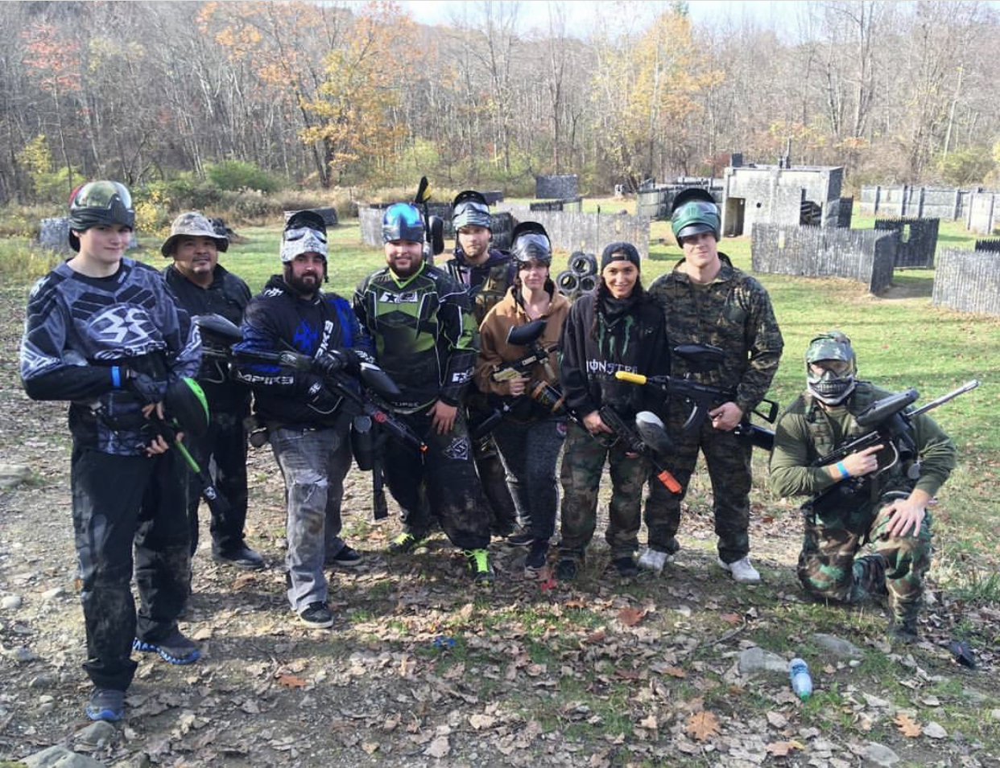

Hi, I'm Brandon Turner (Pictured far left), I am a transfer student from SUNY Ulster and have worked in the field as a web developer for Ulster County. During my time there, I have worked on two major projects. My first project was to heavily modify a C# program that Dutchess county gave to us to help give us support between two programs that would lose functionality to work with each other after an update to one was released. This application is now being actively used by the department of Finance. My second project was to create an application where a county employee could access and search any registered voter in ulster county. It is primarily written in php and is attached to a MySQL database.

I hope to learn more front-end development and get better at using the various javascript frameworks to give me a more diverse skill-set rather than being only back-end. I can see me using these new frameworks to make easy-to-deploy applications for the county or wherever I work in the future. The county has been looking at modernizing both our hardware and software infrastructure, and this would make our county intranet and owned sites more user friendly and up-to-date.
